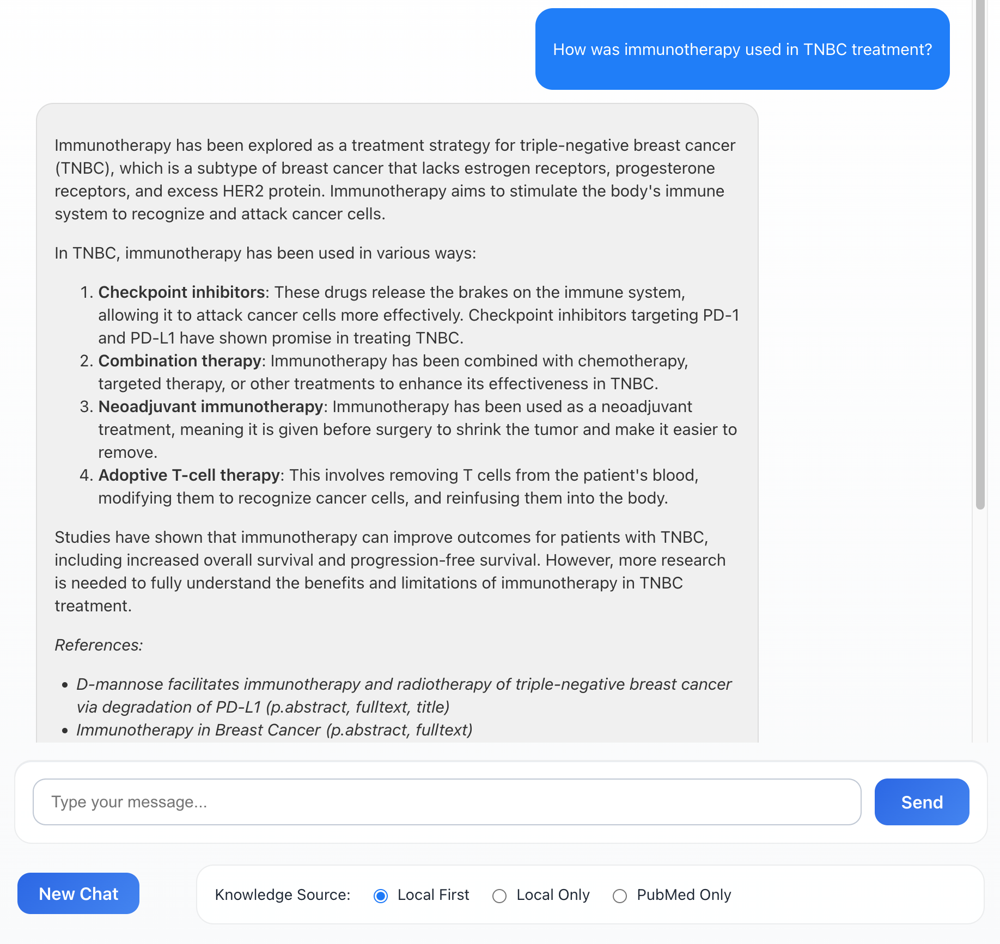

# biolabRAG
*biolabRAG* is a locally deployed Retrieval-Augmented Generation (RAG) system designed for biology research groups. It integrates private knowledge bases with real-time literature searches on PubMed, enabling researchers to efficiently retrieve, synthesize, and reason over both internal and external scientific knowledge.

#### Current Features
* Locally deployed open-source LLM and vector database – no private information is uploaded to the internet.
* Automatic PubMed integration – when local knowledge is insufficient to answer a user’s query, the system searches PubMed and retrieves relevant abstracts and full texts (when available) to enrich the context.
* Cross-encoder ranking – retrieved documents are ranked by relevance using a cross-encoder to optimize context window utilization.
* Multi-turn dialogue support – enables interactive, context-aware conversations across multiple rounds.
* Optimized prompting – designed to generate detailed, well-grounded answers based on both the private knowledge base and external literature.
* Streaming output – supports real-time answer generation with streaming display during response synthesis.

#### Interface

#### Techniques
Framework: LangChain; Frontend: React; Backend: FastAPI; LLM deployer: Ollama; Main LLM: Llama3.1 70B; Embedding model: intfloat/e5-large-v2; cross encoder model: ms-marco-MiniLM-L-6-v2; Vector database: Chroma; PubMed search API: Entrez E-utilities.
